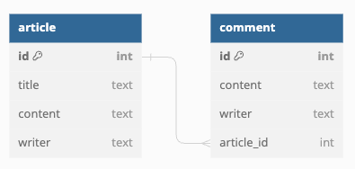
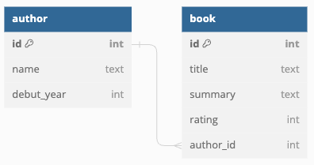
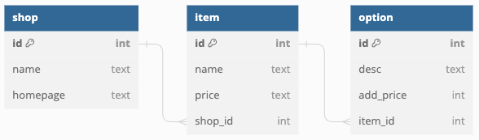

# JPA 연습

여러 Entity를 만들어 보고, CRUD를 위해 활용하는 연습을 해보자.

## Article - Comment

게시글과 댓글의 관계를 나타내는 아래 ERD를 `@Entity`로 만들고,

각각 데이터를 CRUD 할 수 있는 인터페이스를 만들어보자.

## Author - Book

작가와 책의 관계를 나타내는 아래 ERD를 `@Entity`로 만들고,

각각 데이터를 CRUD 할 수 있는 인터페이스를 만들어보자.

## Shop - Item - Option

다음은 상점, 상점 물품, 상점 물품 추가 구성을 나타내는 
세개의 테이블의 관계를 표현한 ERD이다.

각각 데이터를 CRUD 할 수 있는 인터페이스를 만들어보자.
